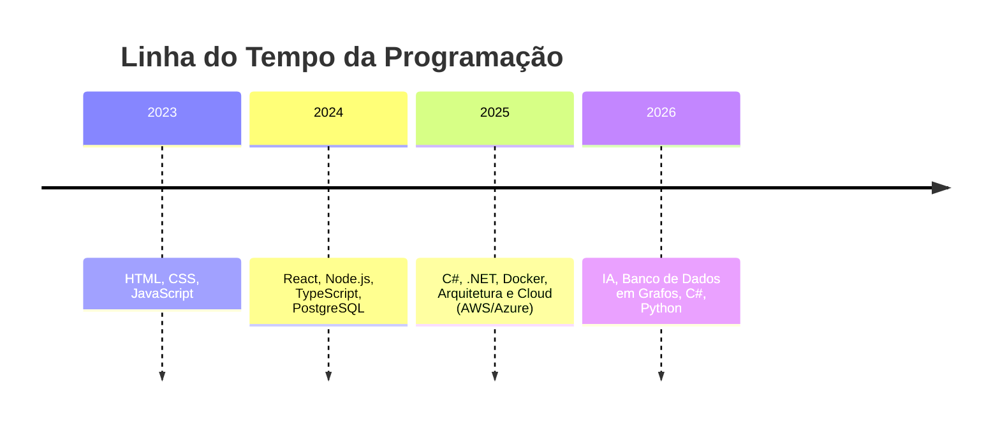

## 👋 Yo! Sou o Giancarlo.

Desenvolvedor, jogador de Gacha Games (Honkai Star Rail, Wuthering Waves e Goddess Of Victory Nikke) nas horas vagas, fã de tecnologia futurista e apaixonado por criar projetos estilosos com propósito.

Estudando **Engenharia da Computação** e atualmente Starter na **GFT Technologies**.

> “Código é como magia: quando funciona, parece poder.” ⚡

---

### ✨ Mood atual

---

### 🧠 Stack que eu trabalho

  
  
  
  
  
  
  

---

### ⚙ Ferramentas que fazem parte do meu dia

  
  
  
  

---

### ⏳ Minha evolução como dev

  

### 🚀 Projetos em destaque

| Projeto | Link | Stack |
|--------|------|-------|
| Portfólio Dev | https://gian-uc.github.io/js-developer-portfolio/ | HTML / CSS / JS |
| One Piece Page | https://gian-uc.github.io/projeto-one-piece/ | HTML / CSS / JS |
| Yu-Gi-Oh Mini Game | https://gian-uc.github.io/yugioh-game/ | JS / DOM / CSS |
| Jogo do Ralph | https://gian-uc.github.io/detonaralphgame/ | JS / DOM / CSS |

### 📡 Contato

### 🧩 Estatísticas

   
      

---

  
🎮 Meus jogos e animes favoritos

  *Final Fantasy, Resident Evil, Elden Ring, God of War, The Last of Us, etc.*

  *Attack on Titan, Jujutsu Kaisen, Kimetsu, One Piece...*

---

### 

---

